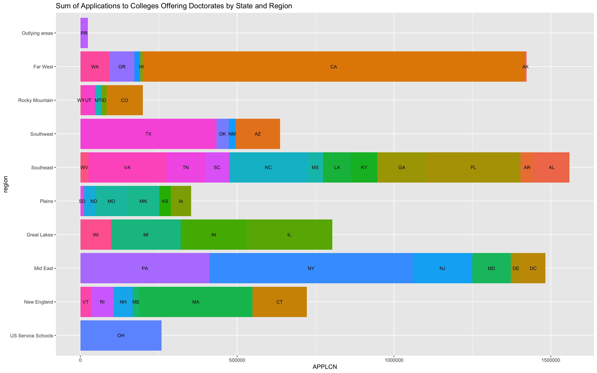

# Data Management - Part 2 Plot

Here is a bar graph showing the total number of college applications received by universities that provide doctoral degrees. This data is further divided into regions as well as labeled by the state in which they are found.

