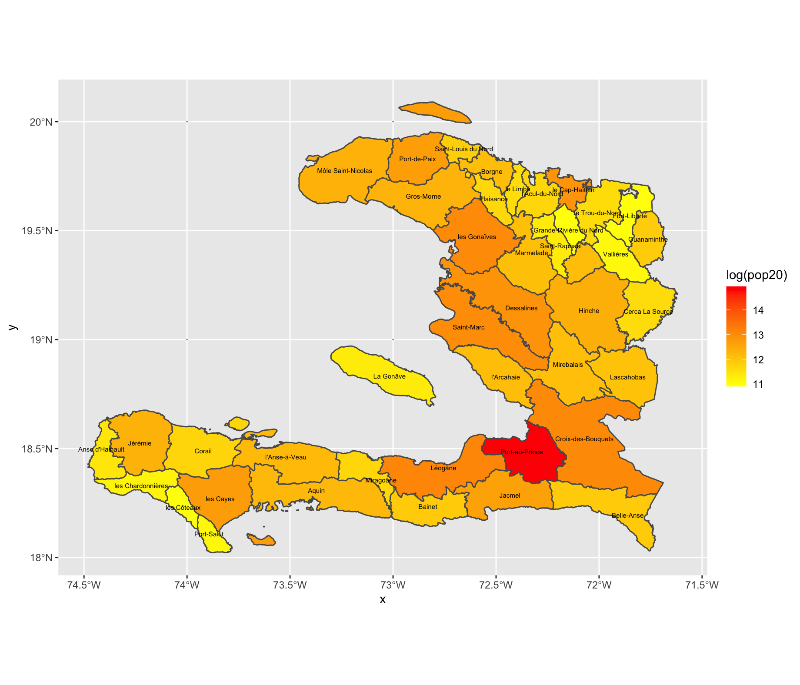

# Project 4

## Deliverable

This is a plot of the country of Haiti and the populations of its largest administrative subdivisions, called "departments." The color gradient used to represent population has been logarithmically transformed and goes from yellow being the lowest to red being the highest. This plot's x and y axes represent longitude and latitude, respectively.

## Stretch Goal 1

This is a plot of the country of Haiti and the populations of its 2nd-largest administrative subdivisions, called "arrondissements." The color gradient used to represent population has been logarithmically transformed and goes from yellow being the lowest to red being the highest. This plot's x and y axes represent longitude and latitude, respectively.

## Stretch Goal 2

This is a plot of the country of Haiti and the populations of its 1st- and 2nd-largest administrative subdivisions, called "departments" and "arrondissements," respectively. The color gradient used to represent population has been logarithmically transformed and goes from blue being the lowest to yellow being the average to red being the highest. This plot's x and y axes represent longitude and latitude, respectively.

## Stretch Goal 3

This is a rotational, 3-D model of the country of Haiti and the populations of its 2nd-largest administrative subdivisions, called "arrondissements." The color gradient used to represent population has been logarithmically transformed and goes from yellow being the lowest to red being the highest. This plot's x and y axes represent longitude and latitude, respectively.

